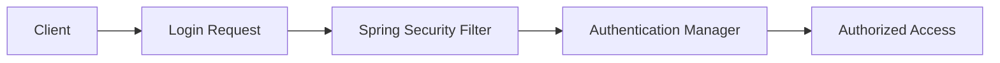

<div align="center">

# 🔐 Spring Security Project

🚀 Designed for learning and extending secure backend APIs


</div>

---

## 📖 About The Project

This project demonstrates how to implement **Spring Security** in a **Spring Boot** application.  
It serves as a **starter template** for securing REST APIs with authentication and authorization.

> 💡 Perfect for beginners and intermediate developers exploring Spring Security concepts.

---

## ✨ Features

✅ Secure application with Spring Security  
✅ Authentication & Authorization  
✅ Role-based access control  
✅ Clean & extensible architecture  
✅ Maven-based build system  

---

## 🧰 Tech Stack

| Technology        | Description                     |
|-------------------|---------------------------------|
| ☕ Java           | JDK 17+                         |
| 🌱 Spring Boot   | Application framework           |
| 🔐 Spring Security | Security & access control      |
| 📦 Maven         | Dependency management           |

---

## 📂 Project Structure

```text
springSecurity
│
└── src
    └── main
        ├── java
        │   └── com
        │       └── security
        │           ├── SpringSecurityApplication.java
        │           │
        │           ├── controller
        │           │   ├── AdminController.java
        │           │   └── AuthController.java
        │           │
        │           ├── dto
        │           │   ├── LoginRequest.java
        │           │   └── RegisterRequest.java
        │           │
        │           ├── entity
        │           │   ├── Role.java
        │           │   └── User.java
        │           │
        │           ├── repository
        │           │   └── UserRepository.java
        │           │
        │           └── security
        │               ├── JwtFilter.java
        │               ├── JwtUtil.java
        │               └── SecurityConfig.java
        │
        └── resources
            └── application.properties
│
├── pom.xml
└── README.md

````

---

## 🚀 Getting Started

### 🔧 Prerequisites

Make sure you have the following installed:

* ☕ Java **17 or higher**
* 📦 Maven **3.6+**
* 💻 IDE (IntelliJ / Eclipse / VS Code)

---

### 📥 Clone the Repository

```bash
git clone https://github.com/pavankalyananna/springSecurity.git
cd springSecurity
```

---

### ▶️ Run the Application

```bash
mvn clean install
mvn spring-boot:run
```

🌍 Application will start at:

```
http://localhost:8080
```

---

## 🔐 Security Flow (Example)



---

## 🧪 Testing

Run all tests using:

```bash
mvn test
```

---

## 🔮 Future Enhancements

✨ JWT Authentication
✨ OAuth2 / Google Login
✨ Database-backed users (JPA + MySQL)
✨ Swagger / OpenAPI docs
✨ Global exception handling


---


